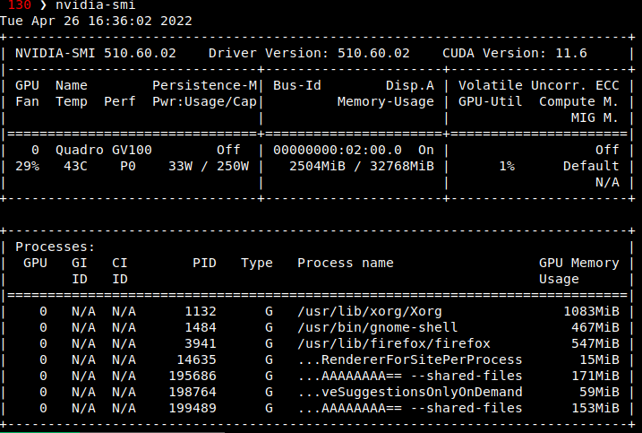

# Docker-compose for local ML

Created: April 26, 2022 3:48 PM
Last Edited Time: May 16, 2022 8:49 PM

ML workflows are a PITA because:

- Every model is a special snowflake, and other people’s tools can come with weird version requirements. You want to provide as much isolation between these dependencies as possible, which means running each one on its own OS.
- Many models have external dependencies (e.g. executables that demand specific versions of GCC) that are typically not in the python ecosystem.  The best way to reproducibly maintain / share / scale these dependencies is with a docker container.
- Tracking model experiments + metrics is annoying, and data management is hard.  It’s worth it to invest in good tooling for this, so that you don’t end up having to guess.
- DevOPs is super annoying, and you want to minimize the effort / maximize your learning on your own machine to make your own environment as scalable as possible.
- The actual ML itself is also hard 😊

**Solution: Dockerize everything.**  

This has a steep learning curve, but will solve several key pain points:

- Reproducibility:
- Model scalability: it’s much easier to deploy a docker container
- Learning: many ML folks have weak sysadmin / DevOps skills, and learning this stack will be incredibly helpful to bring you up to speed.

**My stack (circa April 2022):**

- **Docker** - every package gets its own docker container, which runs in isolation.
- **docker-compose** I want to manage many packages, which means coordinating a few containers.  docker-compose works well for this.
- **Other containers:**
    - [portainer](https://www.portainer.io/) for GUI management of docker images
    - [port forwarding](https://hub.docker.com/r/defreitas/dns-proxy-server) - so I can e.g. use multiply Jupyter notebooks from different containers)
    - [pachyderm](https://hub.docker.com/u/pachyderm) for data versioning and pipelines
    - [weights-and-balances](https://docs.wandb.ai/guides/integrations/other/docker) for metric tracking and
- Project layout looks like this.
    - One repo = one container = one folder in `/code.`  Don't be clever.
    - External libraries / dependencies go in `/projects/code/repo_name/external/`
    - Data is separate from code.
    
    ```bash
    **/projects**
    		**/data
    				/some_data_1**
    						data_1.csv
    				**/some_data_2**
    						data_2.csV
    		**/code**
    				**docker-compose.yml**
    				**/ml_github_repo_2**
    						Dockerfile
    						requirements.txt
    				**/ml_github_repo_2**
    						Dockerfile
    						requirements.txt
    						some_python_file.py
    						**/external
    								/some_annoying_dependency**
    										install.sh
    ```
    

## An opinionated workflow for containerization of ML:

**Quickstart**: 

- We’re going to optimize for running CUDA workflows inside a docker container. This will save you a bunch of problems with NVIDIA drivers and general compatibility.
- We’re going to use the Use NVIDIA drivers [here](https://www.nvidia.com/en-us/drivers/unix/), the NVIDIA toolkit for docker [here](https://docs.nvidia.com/datacenter/cloud-native/container-toolkit/install-guide.html#setting-up-nvidia-container-toolkit), and NVIDIA-distributed containers as your base [here](https://catalog.ngc.nvidia.com/orgs/nvidia/containers/pytorch).
- I’m assuming you don’t spend a ton of time doing Linux sysadmin work (like me) but also that you know your way around bash (like me).

**BUT here be dragons:**

- Unfortunately, the NVIDIA drivers you already have installed are your enemy. There’s a pretty narrow path to gettting dockerized CUDA to work well, and you’ll have to nuke your existing drivers to make it work.

# STEPS

### 1. Blacklist NVIDIA Nouveau drivers

These are not helpful, and extremely difficult to remove.  We’ll blacklist them to help.

To do this, edit  `/etc/modprobe.d/blacklist-nouveau.conf` to blacklist as follows

```jsx
sudo nano /etc/modprobe.d/blacklist-nouveau.conf
```

and edit it to look like:

```jsx
blacklist nouveau
blacklist lbm-nouveau
options nouveau modeset=0
alias nouveau off
```

### 2. Update your system

Update your system as much as possible.  This will install a bunch of drivers you don’t want, but we’ll remove them later.

```jsx
sudo apt update
sudo apt full-upgrade --yes
sudo apt autoremove --yes
sudo apt autoclean --yes
reboot
```

### 3. Remove any existing NVIDIA drivers.

```jsx
sudo apt-get autoremove
sudo apt-get remove nvidia*
sudo apt-get purge cuda*
reboot
```

### 4. Install local NVIDIA drivers

Follow instructions [here](https://www.nvidia.com/en-us/drivers/unix/).  You usually want the most recent one, which (for Ubuntu 2.04 in April 2022) is Version 510.60+.  Once you’ve downloaded the package, install as:

```jsx
sudo sh ./NVIDIA-Linux-x86_64-510.68.02.run
reboot
```

Warning - when you reboot, you may have a wonky display.  Your BIOS will need to be convinced to use the right GPU for your monitor.  Typically you want to fix this by entering your BIOS config generator.  This is pretty easy: hold down `F2` during startup and find 

Once your monitor situation is sorted, verify your installation with the [NVIDIA System Management Interface](https://developer.nvidia.com/nvidia-system-management-interface) as:

```jsx
nvidia-smi
```

You should see something like this.  If you see a ton of N/As in the first few lines then something went wrong.

**Important values: you’ll need both of these later.**

`NVIDIA-SMI` This is the driver version.

`CUDA VERSION` This is the CUDA version



### 5. Install DOCKER + nvidia-docker toolkit

Install Docker + nvidia-docker following instructions [here](https://docs.nvidia.com/datacenter/cloud-native/container-toolkit/install-guide.html#setting-up-nvidia-container-toolkit).

```jsx
# Install docker
curl https://get.docker.com | sh \
  && sudo systemctl --now enable docker

# Set up NVIDIA container toolkit 
distribution=$(. /etc/os-release;echo $ID$VERSION_ID) \
      && curl -fsSL https://nvidia.github.io/libnvidia-container/gpgkey | sudo gpg --dearmor -o /usr/share/keyrings/nvidia-container-toolkit-keyring.gpg \
      && curl -s -L https://nvidia.github.io/libnvidia-container/$distribution/libnvidia-container.list | \
            sed 's#deb https://#deb [signed-by=/usr/share/keyrings/nvidia-container-toolkit-keyring.gpg] https://#g' | \
            sudo tee /etc/apt/sources.list.d/nvidia-container-toolkit.list

sudo apt-get install -y nvidia-docker2
```

### 6. Test installation in a docker container.

If you’re new to docker, here’s a breakdown: we `run` an `image` (which is like a bare-bones OS) to generate a `container` (which is like a running computer)

```jsx
sudo docker run --rm --gpus all nvidia/cuda:**11.6-base** nvidia-smi
```

Breakdown of the command:

`docker run` We’re going to run a container

`--rm` This container is temporary, and we’ll remove once we’re done..

`--gpus all`   Let’s use our GPUs plz.

`nvidia/cuda` This is an NVIDIA-hosted container 

`nvidia/cuda:11.6-base` This container targets CUDA `11.6` - which is what I’ve got installed. 

NOTE: change this value for your own!  It’s probably backwards-compatible (i.e. a newer CUDA version should mostly work fine with an older container) but better safe than sorry.

`nvidia-smi` This is the actual command we’re running.

You should see something like this.  It’s basically the same as the report above, but the running processes are masked because the containerized version of `nvidia-smi` can’t see outside its container.


### 7. Test that pytorch can find cuda

To do this, you want to run an NVIDIA container that already has pytorch installed.  You’ll do this with a command like this.  See [here](https://catalog.ngc.nvidia.com/orgs/nvidia/containers/pytorch) for details:

 `docker run --gpus all -it --rm [nvcr.io/nvidia/pytorch:xx.xx-py3 python](http://nvcr.io/nvidia/pytorch:xx.xx-py3)` 

where

`docker run --gpus all --rm` is as above

`-it` generates an interactive login session

`[nvcr.io](http://nvcr.io)` is the NVIDIA container repository

`[nvidia/pytorch](http://nvcr.io/nvidia/pytorch)` is the name of the container we’re running, and 

`xx.xx-py3` is a placeholder for the version.

`python` we’re running python this time.

To make this run, you have to pick the version from [here](https://docs.nvidia.com/deeplearning/frameworks/pytorch-release-notes/index.html), specifically the [Framework Containers Matrix](https://docs.nvidia.com/deeplearning/frameworks/support-matrix/index.html).  You need to choose the **Container Image Version** that matches the other drivers:

- **CUDA version** - e.g.  `11.60` above
- **NVIDIA Driver version**  - e.g. `510.60.02` above

As of April 2022 this looks like this:


For my case, I use **Container Image** version `22.02` because I’m using NVIDIA CUDA 11.6.0, not 11.6.1.

So the full command **FOR ME** is 

```jsx
 docker run --gpus all -it --rm nvcr.io/nvidia/pytorch:22.02-py3 python
```

This will load me into a python REPL, where I can see if pytorch is happy

```jsx
import torch
torch.cuda.is_available()
```

This should return `True`:


### 8. Oh no it didn’t work!

If it didn’t work, you can either (1) troubleshoot, or (2) run this whole thing over again.  My honest suggestion is to just start over at the top (and maybe read someone else’s blog as a sanity check).  There are lots of ways to break this, and diagnosis is finicky! 

# THE DOCKERFILE

Every github repo gets its own dockerfile.  There are 

We try to solve a bunch of problems at this level

1. **Reproducible build.**  The goal is to set up a docker container that is easy and reproducible.  Ideally, the only thing you should have to add to a new repo is a `Dockerfile`.
2. **File access**  Every container has access to `/code` and `/data`, but nothing else.  
3. **File ownership.**  By default, files generated from a container will have weird ownership, and you won’t be able to change/delete them in your main OS (i.e. the host)!  We fix this by making a new `user` / `group` in the docker container following the discussion [here](https://vsupalov.com/docker-shared-permissions/) and [here](https://stackoverflow.com/questions/27701930/add-user-to-docker-container).
4. **Python ENV management.** I prefer to set everything up in a Conda env, but I just do it in the `base` env.  I then run some combination of `conda install` ****and `pip install` to actually get the repo up and running.
5. **Run Jupyter Lab** Each container runs its own juypter-lab server.  This is launched as the last command: `CMD jupyter-lab ...` but needs to be modified to enable easy login.
6. **Caveat: Security**  Security is intentionally broken here. You can, for instance, log into any jupyter-lab server without a password (or with a dumb password).  You can then delete all the data in `/data` if you want. So this approach is not ideal for shared environments, mission-critical workflows, or network-exposed computers without good firewalls.  I probably don’t do as much as I should here. 

Here’s an example dockerfile: 

```docker
FROM nvcr.io/nvidia/pytorch:22.02-py3

### PASSED FROM DOCKERFILE
# IF NOT, DEFAULTS HERE ARE USED
ARG USER_ID
ARG GROUP_ID
ARG JUPYTER_PORT
ARG JUPYTER_TOKEN

###  Directory of repo in docker container
ARG REPO_DIR=/code/pytorch_test 

### Python requirements file
ARG REQUIREMENTS_FILE=requirements.txt

### Name of conda env.
ARG CONDA_ENV=container_env


RUN echo USER_ID ${USER_ID} && \
    echo GROUP_ID ${GROUP_ID} && \
    echo JUPYTER_PORT ${JUPYTER_PORT} && \
    echo JUPYTER_TOKEN ${JUPYTER_TOKEN} && \
    echo REPO_DIR ${REPO_DIR} && \
    echo REQUIREMENTS_FILE ${REQUIREMENTS_FILE} && \
    echo CONDA_ENV ${CONDA_ENV}
    
# #################### BOILERPLATE ####################################3

### CHANGE USER
RUN addgroup --gid $GROUP_ID user
RUN adduser --disabled-password --gecos '' --uid ${USER_ID} --gid ${GROUP_ID} user
USER user

### INSTALL oh-my-bash
WORKDIR ${REPO_DIR}/external/
RUN bash -c "$(wget https://raw.githubusercontent.com/ohmybash/oh-my-bash/master/tools/install.sh -O -)"; exit 0
WORKDIR ${REPO_DIR}

### SET UP CONDA ENV
RUN conda create --name ${CONDA_ENV} --clone base
RUN conda env list

## NOTE _ REPLACED BY CONDA .BASHRC EDIT BELOW
# CHANGE CONDA ENV per https://pythonspeed.com/articles/activate-conda-dockerfile/
# We have to do "echo ${CONDA_ENV}" because each element in the shell JSON is execututed by shell separately.
# If conda >= 4.9
#SHELL ["conda", "run",  "--no-capture-output", "-n", "echo $CONDA_ENV", "/bin/bash", "-c"]  X
# If conda < 4.9
# SHELL ["conda", "run", "-n", "echo $CONDA_ENV", "/bin/bash", "-c"] 
#RUN conda env list

### Copy External libs to local
# COPY ./external ${REPO_DIR}/external

### TO INSTALL DEPENDENCIES WRAP THEM IN A CMD LIKE
# RUN cmake <<whatever>>  \
#    && make  \
#    && make install 

### MAKE CONDA WORK AT THE COMMAND LINE
RUN conda init bash
RUN echo "conda activate container_env" >> ~/.bashrc
RUN conda env list
RUN conda list

### INSTALL REQUIREMENTS
WORKDIR ${REPO_DIR}
COPY ./requirements.txt .
RUN ls -al
RUN conda install --file requirements.txt

### ACTIVATE JUPYTER_LAB ON DEFAULT PORT 8888
# COPY JUPYTER-LAB CONFIGS
COPY ./jupyter_lab_config.py /root/.jupyter/jupyter_lab_config.py
RUN echo jupyter-lab --ip=0.0.0.0 --port ${JUPYTER_PORT} --no-browser --allow-root --ServerApp.token=\${JUPYTER_TOKEN}
CMD nohup jupyter-lab --ip=0.0.0.0 --port ${JUPYTER_PORT} --no-browser --allow-root --ServerApp.token=\${JUPYTER_TOKEN} & 
# RUN ["echo","jupyter-lab", "--ip=0.0.0.0 --port", "echo ${JUPYTER_PORT}","--no-browser --allow-root --ServerApp.token=","echo ${JUPYTER_TOKEN}"]
# CMD ["jupyter-lab", "--ip=0.0.0.0 --port", "echo ${JUPYTER_PORT}","--no-browser --allow-root --ServerApp.token=","echo ${JUPYTER_TOKEN}"]
```

# THE DOCKER-COMPOSE FILE

Here’s an example docker-compose file.  I run a few services:

- **dns-proxy-server** : this allows me to access any service (i.e. `repo` —> `container` —> `service`) as `http://repo_name.docker:PORT`.  This is helpful for making multiple jupyter-lab servers play nicely together.
- **citeseq:** This is an example repo that does fthe following:

```yaml
version: "3.2"
services:

  dns-proxy-server:
    image: defreitas/dns-proxy-server
    hostname: dns.mageddo
    # name: dns-proxy-server
    ports:
      - "5380:5380"
    volumes:
      - type: bind
        source: /opt/dns-proxy-server/conf
        target: /app/conf
      - type: bind
        source: /var/run/docker.sock
        target: /var/run/docker.sock
      - type: bind
        source: /etc/resolv.conf
        target: /etc/resolv.conf


  pytorch_test:
    image: nvcr.io/nvidia/pytorch:22.02-py3
    build: ./code/pytorch_test
    environment:
      JUPYTER_PORT: 8082 # CHANGE FOR EVERY REPO - must match ports values below
      JUPYTER_TOKEN: ${JUPYTER_TOKEN}
      USER_ID: ${USER_ID}
      GROUP_ID: ${GROUP_ID}
    hostname: pytorch_test.docker
    ports:
      - "8082:8082" # MUST MATCH JUPYTER_PORT ABOVE
    volumes:
      - type: bind
        source: ./data
        target: /data
      - type: bind
        source: ./code
        target: /code
    # links:
    deploy:
      resources:
        reservations:
          devices:
            - driver: nvidia
              count: all
              capabilities: 
                - gpu
                - utility # nvidia-smi
                - compute # CUDA. Required to avoid "CUDA version: N/A"
    ipc: host
    ulimits:
      memlock: -1
      stack: 67108864
    stdin_open: true
    tty: true

```